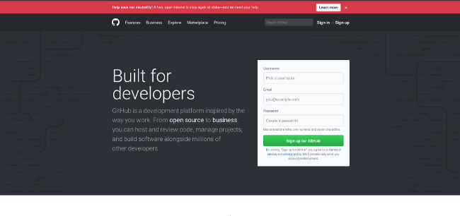
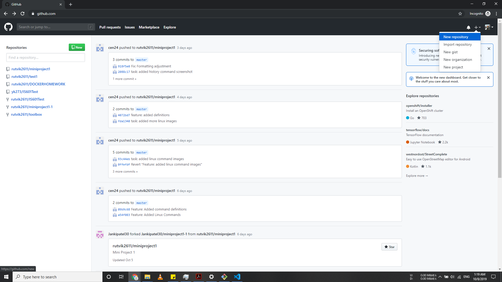
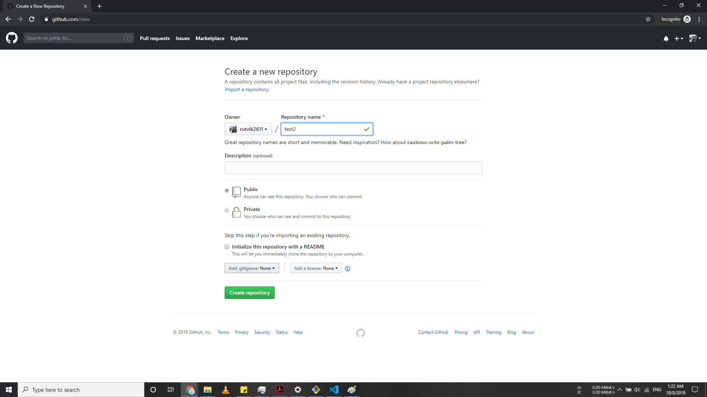
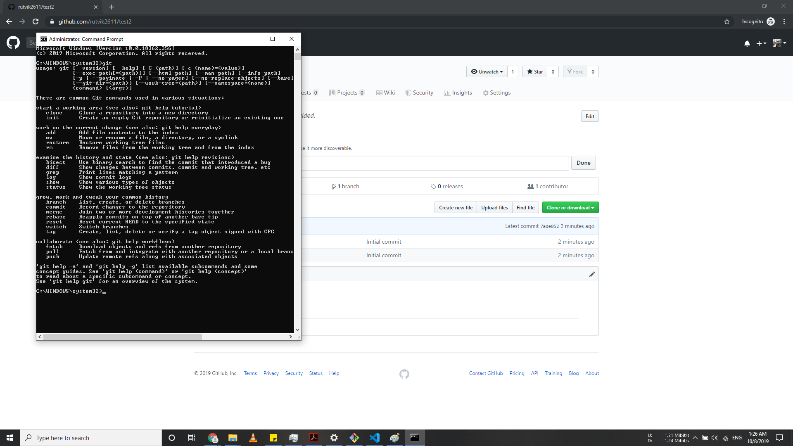

# A03

**Define Terms**

Document your knowledge of Git, GitHub and Webstorm by creating a step by step tutorial in your readme file.

- [X] Git
- [X] Github Tutorial
- [X] Webstorm

# GIT Tutorial: A step by step guide to Git

# Step 1: Create a GitHub account

# Step 2: Create a new repository

A repository is like a place or a container where something is stored; in this case we're creating a Git repository to store code. To create a new repository, select New Repository from the + sign dropdown menu (you can see I've selected it in the upper-right corner in the image above).

Enter a name for your repository (e.g, "Demo") and click Create Repository.

# Step 3: Create a file

Create a new file from terminal and ignore the rest for now.

Open the Terminal program on your PC.

or then again on Windows you can utilize cmd and guid it to the organizer where you stored the repo.

with directions like cd,mkdir and rm.

Type git and hit Enter. If it says command bash: git: command not found, then install Git with the command for your Linux operating system or distribution. Check the installation by typing git and hitting Enter; if it's installed, you should see a bunch of information about how you can use the command.

In the terminal, type:

mkdir Demo
This command will create a directory (or folder) named Demo.

Change your terminal to the Demo directory with the command:

cd Demo
Then enter:

echo "#Demo" >> README.md
This creates a file named README.md and writes

cat README.md
This will show you what is inside the README.md file, if the file was created correctly.

To tell your computer that Demo is a directory managed by the Git program, enter:

git init
Then, to tell the Git program you care about this file and want to track any changes from this point forward, enter:

git add README.md

#tep 4: Make a commit

So far you've made a document and informed Git concerning it, and now it's an ideal opportunity to make a submit. Submit can be thought of as an achievement. Each time you achieve some work, you can do an git commit  to store that variant of your record, so you can return later and see what it resembled by then. At whatever point you roll out an improvement to your record, you make another rendition of that document, not the same as the past one.

# Step 5: Connect your GitHub repo with your computer

Now, it's time to connect your computer to GitHub with the command:

 **git config**

Usage: **git config –-global user.name &quot;[name]&quot;**

Usage: **git config –-global user.email &quot;[email address]&quot;**

This command sets the author name and email address respectively to be used with your commits.

Now you can learn basic commands of the git from this document.

**Git Tutorial referenced from work done in Miniproject1**

# GitHub Flow
This is a branch based workflow built around the git commands described above and other commands as well which are used by teams and people around the globe. Branch based meaning each team member can create a local copy of the repository on their system to work on and update code and then push it to the Master repository when complete.

**Merge -** Upon clicking merge, GitHub automatically performs the equivalent of a local ‘git merge’ operation. GitHub also keeps the entire branch development history on the merged pull request.

**Merge Conflict -** Merge conflicts happen when you merge branches that have competing commits, and Git needs your help to decide which changes to incorporate in the final merge. Git can often resolve differences between branches and merge them automatically.

**Fetch -** This allows you download files and changes from the remote to your local repository. I advise that you always do this before you start working on code or making changes so as to avoid conflicts or working on code your teammate might have already completed

**Remote -** This is the common repository all team members used to exchange their changes. The Remote repository should be most updated version of the code repository. Think of this like a final version after all combined changes by team members. This is where GitHub comes in. The remote version is usually stored on a hosting service like GitHub or a local server.

# GIT & GitHub
Git is a free and open source distributed version control system designed to handle everything from small to very large projects with speed and efficiency. A version control system, or VCS, tracks the history of changes as people and teams collaborate on projects together. Commonly used for both open source and commercial software development, with significant benefits for teams.

Git allows developers see the entire timeline of their changes, decisions, and progression of any project in one place which is GitHub.

GitHub is a Git hosting repository that provides developers with tools to ship better code through command line features, issues (threaded discussions) and pull requests a code for review. A repository  the entire collection of files and folders associated with a project, along with each file’s revision history. The file history appears as snapshots in time called commits, and the commits exist as a linked-list relationship, and can be organized into multiple lines of development called branches.

# Basic Git Commands Includes

**Clone -** creates a local copy of a project that already exists remotely. The clone includes all the codes, project’s files, history, and branches.

**Commit -** saves the snapshot to the project history and completes the change-tracking process.

**Push -** updates the remote repository with any commits made locally to a branch.

**Pull -** updates the local line of development with updates from its remote counterpart. Developers use this command if a teammate has made commits to a branch on a remote, and they would like to reflect those changes in their local environment.

**Branch -** shows the branches made from Master which are being worked on locally.

# Webstorm
WebStorm is a powerful IDE for modern JavaScript development. WebStorm provides full support for JavaScript, TypeScript, HTML, CSS as well as for frameworks such as React, Angular, and Vue.js right out of the box, no additional plugins are required. Besides client-side applications, WebStorm helps you develop server-side applications with Node.js, mobile apps with React Native or Cordova, and desktop apps with Electron. Note that having Node.js is highly recommended although the core WebStorm features are still at your disposal without it.

# Instructions from Professor
Your commits should have clear messages like:
- [x] Task: create Repository
- [x] Feature: added workflow for using gitHub
- [x] Fix: changed readme.md for definition of terms

# Reference
- Miniproject1 (contributed by Rutwik & Chinedu)
- Git Handbook - https://guides.github.com/introduction/git-handbook/
- Jet Brains - https://www.jetbrains.com/help/webstorm/getting-started-with-webstorm.html
